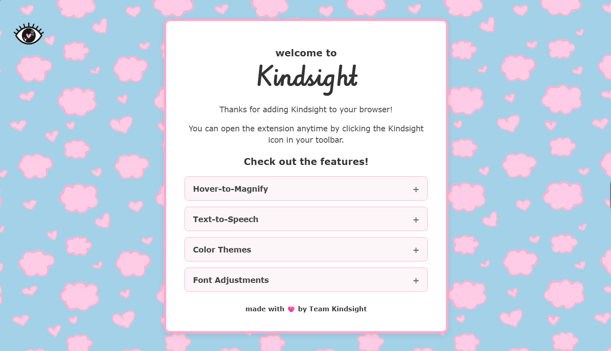
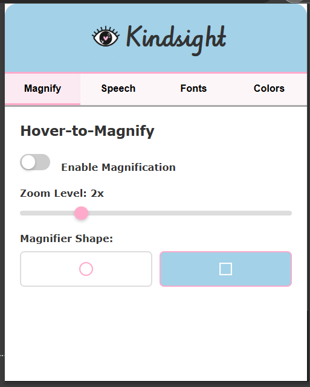
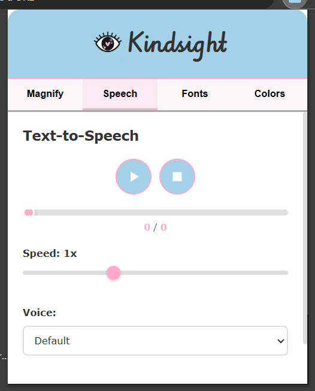
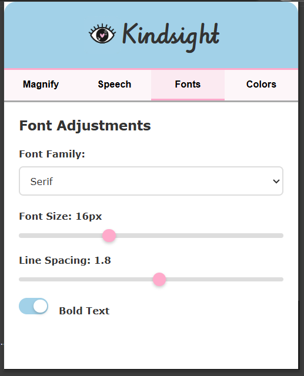
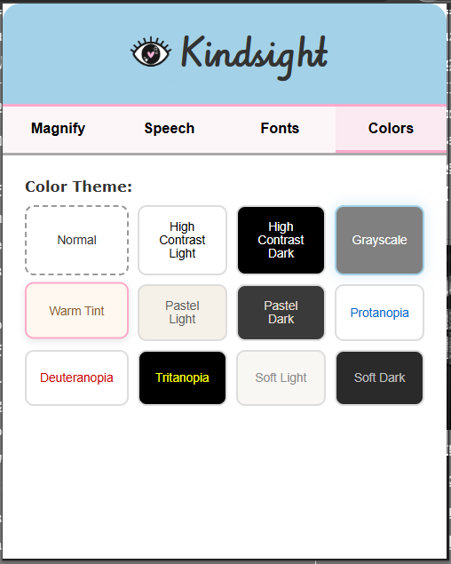

# Kindsight

Kindsight is a browser extension that enhances web readability and accessibility without altering content on websites. We designed it for anyone who benefits from clearer/larger text, different themes, reduced visual strain, or higher contrast. 

Our features include...
- DOM-based magnifier, which can be adjusted by zoom or shape
- text-to-speech reader (with both highlight-and-play and auto-play)
- fonts! includes line spacing, font size, and bold
- colors. users can choose from a range of different color themes.

On downloading/adding this extension to their Chrome, users are met with this page:

The feature boxes drop down and let users see what features they'll be getting!

The actual extension looks like this:

